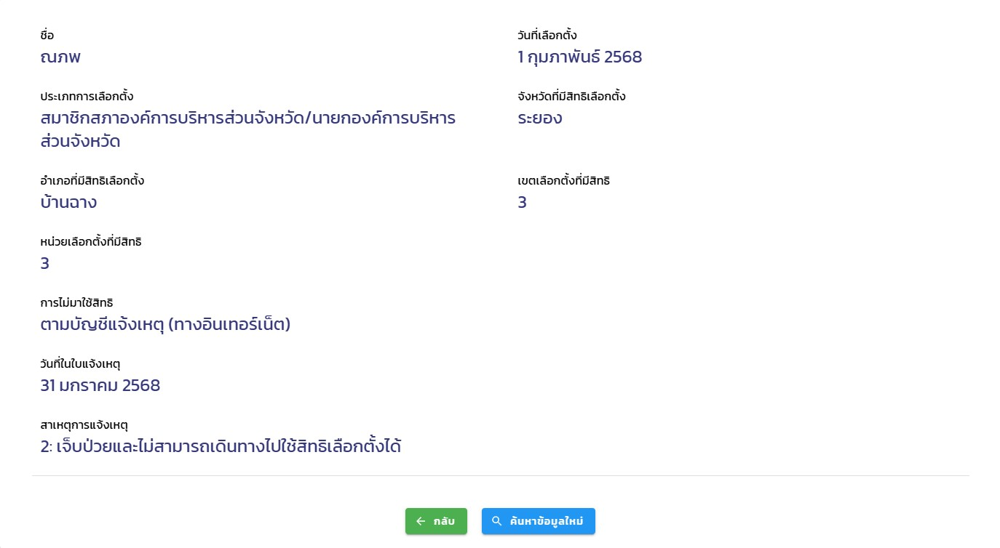

# 2025 PAO Elections 🗳️
นับเป็นอีกครั้งแล้วนะครับหลังจากที่เลือกตั้งนายกกันไป เราได้ใช้สิทธิ์อีกครั้งนึง เมื่อวันที่ 1 กุมภาพันธ์ 2568 ได้มีการเลือกตั้ง อบจ. ทุกๆ 4 ปีเลยนะครับการที่เราจะได้เลือก
เราในฐานะคนไทยถ้าเราสะดวกก็อย่าลืมไปใช้สิทธิ์กันนะครับ นอนหลับทับสิทธิ์ไม่ดีนะครับ เดี๋ยวมันจะแบน 🤣🤣🤣

> จากภาพคือการแจ้งไม่ใช้สิทธิ์นะครับเนื่องจากความไม่สะดวก เสียดายที่ผมไปใช้สิทธิ์ไม่ได้

# ไม่สะดวกไปใช้สิทธิ์ทำยังไงดี 🤔
คนส่วนใหญ่ก็ได้ไปใช้สิทธิ์กันใช่ไหมครับ แล้วคนที่ไม่ได้ไปใช้สิทธิ์เนื่องจากเหตุจำเป็นละครับทำยังไงดี 
1 ในนั้นก็คือผมครับ ผมป่วยหนักมากๆ จนไปใช้สิทธิ์ที่เขตตัวเองไม่ได้ครับ แต่ๆ ทางรัฐบาลก็ได้มีการให้ลงคำขอไม่ใช้สิทธิ์ผ่านทาง Website นะครับ ลงที่นี่ได้เลย
[แจ้งไม่ใช้สิทธิ์](https://boraservices.bora.dopa.go.th/election/abscauselocal/) 
ซึ่งมีอีก 2 วิธีนะครับ แต่ว่าวิธีออนไลน์จะสะดวกที่สุดครับ

- ระยะเวลา ⏰ : ก่อนเลือกตั้ง 7 วัน และ หลังเลือกตั้ง 7 วัน

# ติดตามผลแบบ Realtime 〽️
อยากติดตามผล สามารถติดตามได้ที่ [ติดตามผลการเลือกตั้ง](https://www.ect.go.th/ect_th/th/announcement-of-election-results.php)
