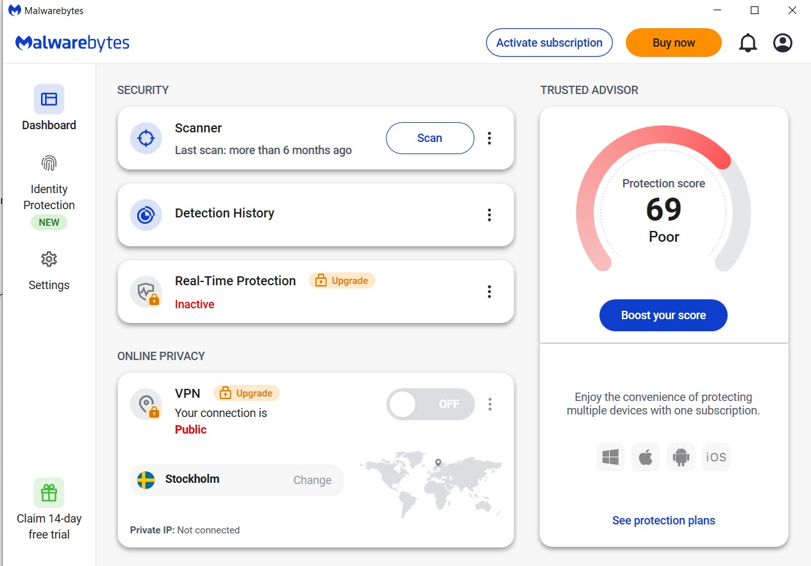

# Security Control in daily life

นี่คือ Malwarebyte โปรแกรม Anti-virus ที่จะช่วยเราปกป้องคอมพิวเตอร์เราให้ปลอดภัย เราสามารถจัดหมวดหมู่ให้มันได้ว่า

- Technical เพราะว่า เป็นเทคโนโลยีในที่นี้ก็คือ Software
- Preventive เพราะว่า เป็นการยับยั้งไวรัส หรือ ไฟล์ที่เป็นอันตรายต่อเครื่อง โดยทำการบล็อค

# ดังนั้นแล้ว
Malwarebyte จัดเป็น Software ที่อยู่ในหมวดของ Technical และ Preventive เพราะเป็น Software ที่มีความสามารถในการยับยั้ง หรือ หยุด สิ่งที่จะเป็นอันตรายต่อเครื่องได้
